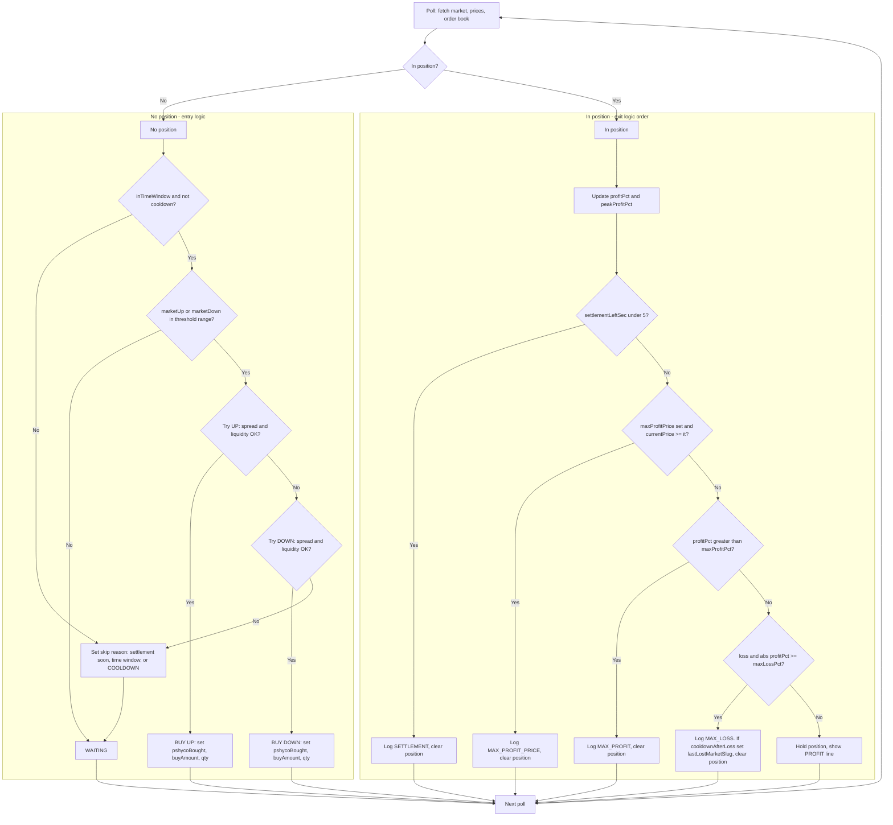

# PSHYCO Trading Process Flow

## Exit check order (when in position)

1. **Settlement** — Time to settlement &lt; 5s → exit, log `SETTLEMENT`.
2. **Max profit price** — `maxProfitPrice` set and current price ≥ it → exit, log `MAX_PROFIT_PRICE`.
3. **Max profit %** — `profitPct > maxProfitPct` → exit, log `MAX_PROFIT`.
4. **Max loss %** — `profitPct` negative and `|profitPct| >= maxLossPct` → exit, set market cooldown, log `MAX_LOSS`.
5. Otherwise **hold** and continue polling.

## Entry conditions (when no position)

- **Time window**: `settlementLeftSec > 5` and `minTimeLeftMin <= timeLeftMin <= maxTimeLeftMin`.
- **Not on cooldown** (if `cooldownAfterLoss` is true: current `marketSlug` must not equal the slug we last lost on; resets when a new market slug is selected).
- **Price in range**: `marketUp` or `marketDown` in `(entryThreshold, entryMaxThreshold)`.
- **Spread**: For the side (UP/DOWN), `spreadPct <= maxSpreadPct`.
- **Liquidity**: For the side, `askLiquidity >= minLiquidity`.

If UP and DOWN both qualify, UP is tried first; if UP is bought, DOWN is not tried.
